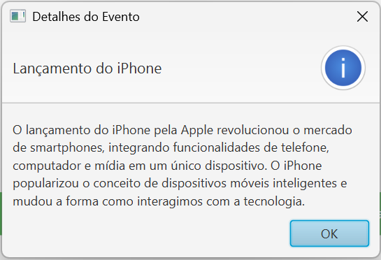

# Histórico Interativo das Telecomunicações

Este projeto é um aplicativo JavaFX desenvolvido para proporcionar uma maneira interativa e educativa de explorar os marcos históricos das telecomunicações. Por meio de uma linha do tempo visual, o usuário pode aprender sobre eventos transformadores como a invenção do telégrafo, a criação da World Wide Web (WWW) e a implementação da rede 5G.

## Objetivo

O objetivo deste projeto é fornecer uma representação visual das transformações nas telecomunicações ao longo da história. O aplicativo permite que os usuários interajam com marcos importantes da área, explorando a evolução dos meios de comunicação, desde as primeiras invenções até as tecnologias mais recentes. A ideia é facilitar a compreensão da importância de cada inovação e como elas impactaram o mundo.

## Funcionalidades

- **Linha do Tempo Interativa**: Uma representação gráfica dos principais eventos históricos das telecomunicações, organizada de maneira cronológica e acessível.
- **Exibição de Descrições Detalhadas**: Ao clicar em qualquer evento, o usuário é apresentado a uma descrição detalhada sobre o marco histórico, destacando seu impacto e relevância para o desenvolvimento das telecomunicações.
- **Interface Limpa e Intuitiva**: A interface foi projetada para ser simples e de fácil navegação, permitindo que os usuários se concentrem na experiência de aprendizado sem distrações.
- **Uso de Alertas**: Cada botão na linha do tempo está associado a um evento histórico, e ao clicar nele, uma janela de alerta exibe informações contextuais sobre o evento.

## Marcos Históricos Incluídos

A linha do tempo contém uma seleção dos principais marcos na evolução das telecomunicações:

- **1837** - Invenção do Telégrafo: A primeira tecnologia de comunicação à distância, que revolucionou a troca de mensagens em tempos de guerra e comércio.
- **1876** - Invenção do Telefone: Alexander Graham Bell cria o primeiro aparelho telefônico, possibilitando a comunicação de voz à distância.
- **1895** - Primeira Transmissão de Rádio: Guglielmo Marconi realiza a primeira transmissão de rádio sem fio, um marco para a comunicação em massa.
- **1927** - Primeira Ligação Telefônica Transatlântica: O primeiro contato telefônico entre os Estados Unidos e a Europa, demonstrando a capacidade das telecomunicações para conectar continentes.
- **1962** - Lançamento do Satélite Telstar 1: O primeiro satélite de comunicação ativo, que fez a primeira transmissão de televisão ao vivo via satélite.
- **1983** - Introdução do Telefone Celular: O lançamento do primeiro sistema de telefonia celular, que começou a transformar a forma como as pessoas se comunicavam.
- **1989** - Criação da World Wide Web (WWW): Tim Berners-Lee desenvolve a Web, mudando para sempre a maneira como interagimos com a informação e conectamos pessoas ao redor do mundo.
- **1991** - Chegada das Redes 2G: O advento das redes móveis de segunda geração, que possibilitaram a comunicação digital, SMS e outros serviços.
- **2007** - Lançamento do iPhone: A introdução do iPhone pela Apple, um marco no desenvolvimento de smartphones e no conceito de dispositivos móveis multifuncionais.
- **2019** - Implementação da Rede 5G: O lançamento da quinta geração de redes móveis, que promete velocidades ultrarrápidas e novas possibilidades para a comunicação e IoT (Internet das Coisas).

## Tecnologias Utilizadas

Este projeto utiliza as seguintes tecnologias para criar uma experiência interativa e visualmente agradável:

- **Java (JDK 17)**: A linguagem de programação principal utilizada para o desenvolvimento.
- **JavaFX**: Framework para a construção de interfaces gráficas interativas.
- **FXML**: Utilizado para a definição do layout da interface de forma declarativa, facilitando a manutenção e a personalização.
- **CSS**: Para estilização da interface e melhor visualização dos elementos na tela.

## Contribuições

Este projeto é aberto a contribuições. Se você deseja sugerir melhorias, corrigir erros ou adicionar novos marcos históricos à linha do tempo, fique à vontade para abrir uma issue ou enviar um pull request. Sua contribuição é muito bem-vinda!

## Créditos

Desenvolvido por Mateus S.  
GitHub: [Matz-Turing](https://github.com/Matz-Turing)
